# Portal Box 5.1.0
## A project by Bucknellians for Bucknellians, since 2013
   

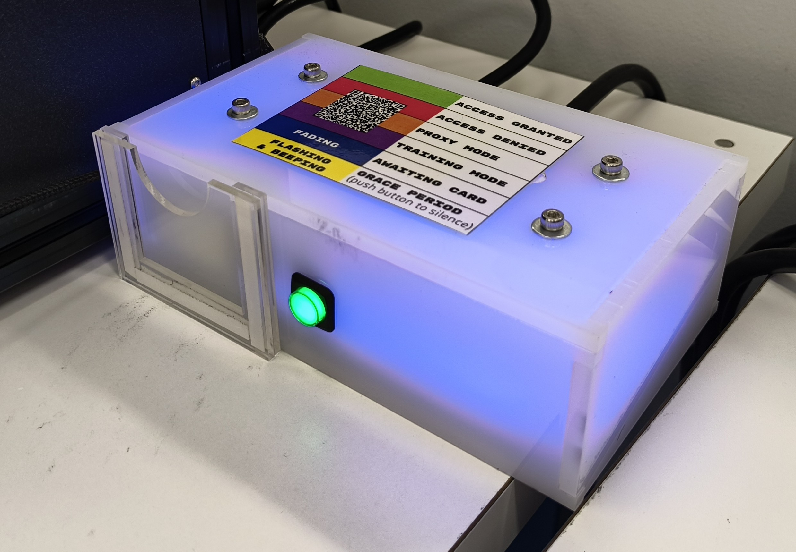 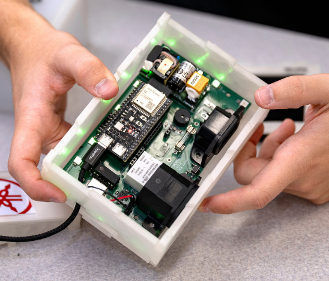

*The currently implemented Portalbox, v2, in the Maker-E connected to a Prusa XL (left) and a v5.0.6 prototype (right).*

## Background
The Portalbox is an open-source makerspace management project. It originated at Bucknell University, in our makerspace the "Maker-E", and intends to spread worldwide, allowing makerspaces to control their equipment and their users as they see fit. The Portalbox focuses on using interlocks to control power to equipment, such as 3D printers or laser cutters, based on the RFID cards that each student possesses. I had the opportunity to work on v5 of the Portalbox over the summer of 2025, continuing into the academic year 25-26.

The Portalbox has been an ongoing project for roughly a decade, remaining open-source and created by students throughout its lifetime. Professor Joe Hass and software engineer TKEgan on GitHub have historically maintained the project for both firmware and backend development, including but not limited to the database and website access that's used by student techs to change permissions to each Portalbox.

 Previous Implementation 

## Current Implementation

As it stands, the Portalbox is in the MakerE and for the most part, working as intended. It includes a very simple I/O: A slot for an RFID card, a simple pushbutton, and on the back two power ports and a reset button. It utilizes a finite state machine design to work with RFID reader and button input to ascern what mode of functionality it should be in. As much of this functionality has been retained for the next iteration. 

Use of the current Portalbox is very simple, intentionally so. Simply place your RFID card, programmed by a technician or makerspace administrator, into the card slot. The Portalbox will light blue if you are marked as certified in an SQL database, and red if you're not. If it determines that you are certified, it will activate the power interlock and allow wall power to flow to the machine that it's connected to, be it a 3D printer, laser cutter, or soldering iron. When you remove your card, the box will begin blinking yellow and beeping at you. Pressing the button on the front will exit this "grace mode". Putting your card back in will accomplish the same as putting your card in originally. However, if you place in a card programmed as a "proxy card", the box will light orange and remain on. The result is that you may use the machine or leave it running, but keep your assigned RFID card with you. Finally, if a user assigned as a trainer in the database takes their card out of the box, a non-certified user may place theirs as a replacement. The box will light purple for "training" mode, allowing the user to temporarily keep the equipment active while learning how to use it. After they have been trained on the piece of equipment a technician can certify them so they may use it in the future.

Technical information

## Technical
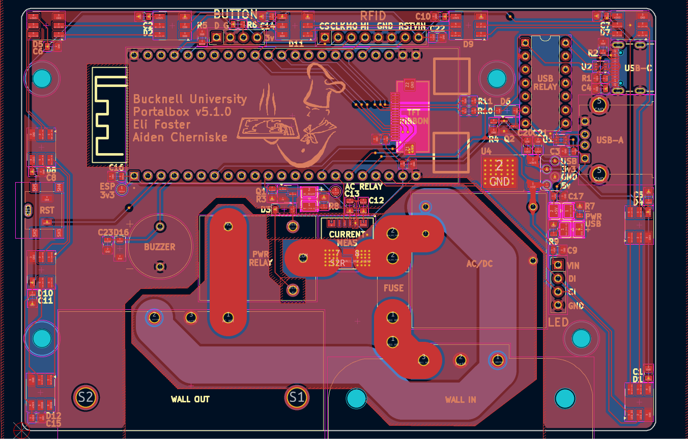
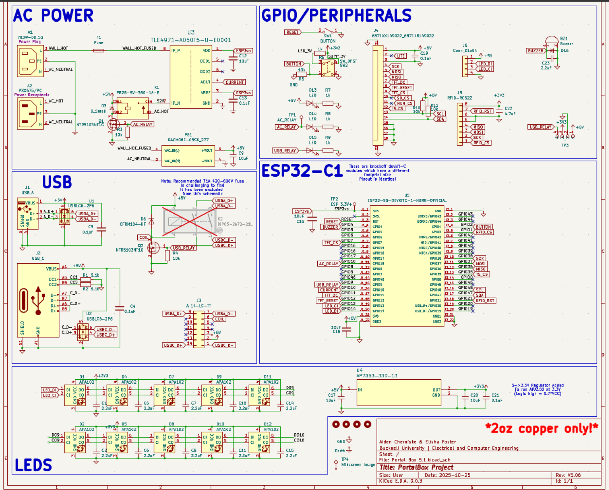

*Portalbox v5.1.0 layout (left) and schematic (right)*

Power Interlock

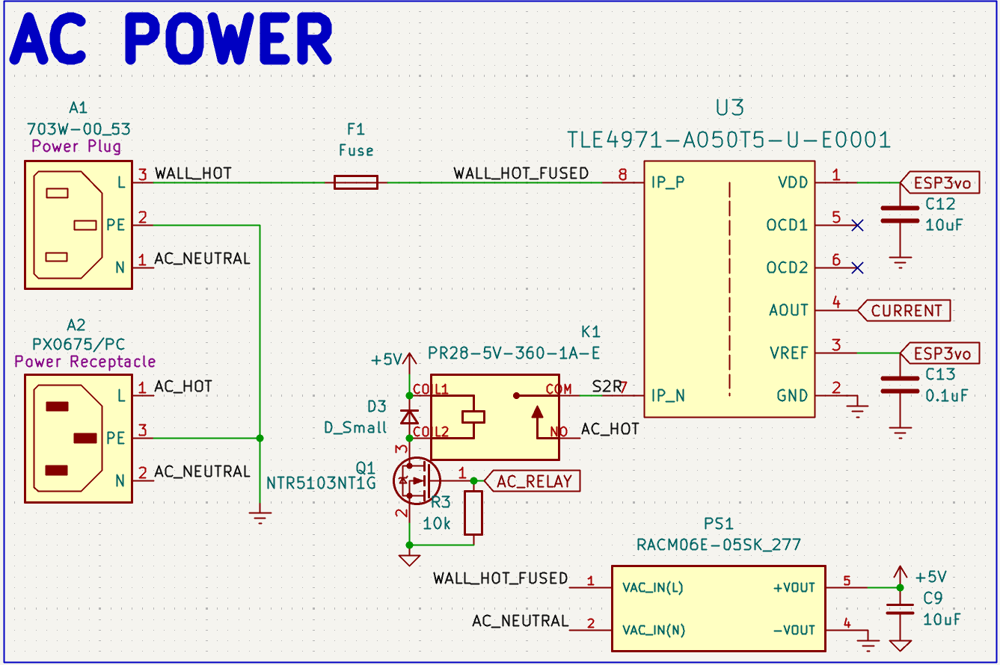
### Overview
The Portalbox itself is powered off of 120Vrms from the wall, allowing for simpler placement and no worries or frustrations regarding battery power, lifetime, and so on. We use a hefty AC/DC converted to provide 5v power to the rest of the Portalbox, including the ESP32. We use relays to interlock wall power in between our two ports, one IEC C13 and one IEC C14. The female C13 is intended to be connected to wall power, while the male C14 is 15A fused output to makerspace equipment. We also include a current measurement IC to monitor power draw from a machine and monitor relay accuracy. Ensure that only 2 ounce copper is used when manufacturing: trace widths have been calculated to 2oz and traces may turn into fuses if incorrectly manufactured.
### Relay
We chose a [CUI Devices 20A relay](https://www.digikey.com/en/products/detail/same-sky-formerly-cui-devices/PR28-5V-360-1A-E/22522201?s=N4IgTCBcDa5mBmAtABwE5gBxIKwDckEA2ABiQEYBDJAUyQDsATEAXQF8g "Digikey") to ensure that our fuse would disconnect the circuit before any parts become damaged. The relay accepts the hot line from the wall and outputs it to the current measurement IC when the relay is activated. Activation is done using a simple [NMOS transistor](https://www.digikey.com/en/products/detail/diodes-incorporated/2N7002K-7/1934378?s=N4IgTCBcDa4HIHYAMSwGkC0CAiBJAwgCoZzYgC6AvkA "Digikey") circuit to allow for a 3v GPIO pin from the ESP32 to activate the relay using 5v (its required activation voltage). This specific transistor was chosen for availability, being pre-stocked in our space.

### Current Measurement
We're measuring current flowing from the wall out to the C14 port for a multitude of reasons. With proper implementation, this would allow for a measurement of "normal" current draw for any given machine, thus allowing continuous monitoring and flagging of any unusual or concerning behavior remotely. It would also allow us to retrieve records or throw a flag if our maximum of 15A is reached, thus requiring us to replace the onboard fuse. This would require some implementation with the existing MariaDB SQL database to store said current data and/or flags. Measurement is accomplished using an [Infineon IC](https://www.digikey.com/en/products/detail/infineon-technologies/TLE4971A050T5UE0001XUMA1/18700354?s=N4IgTCBcDaICoBkCiAWAnAdgIwFoCCADAKwFxE4CqOSBtWIAugL5A "Digikey") for this specific purpose. It's capable of +-120A, being much more than we need. It ouputs a variable voltage that depends on the current flowing through two major pads, allowing for later conversion into what specific current is being measured.

USB Interlock

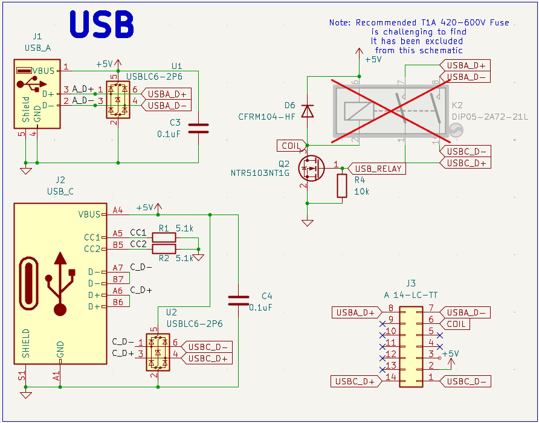
### Overview
The Portalbox is equipped to provide data interlock through USB 2.0 between a USB-A port and a USB-C port. This is for specific applications such as the Maker-E's laser cutter, where proprietary power supply makes power interlock difficult. However, one is able to connect USB cables in between the cutter and a dedicated device to restrict data transfer of files required for laser cutting. It uses a similar relay structure to the power interlock to allow for robust switching.

### Relay
We use a [Standex-Meder](https://www.digikey.com/en/products/detail/standex-meder-electronics/DIP05-2A72-21L/2765346?s=N4IgTCBcDaICIEkAKAGArAWjAQQOxiwEYAZEAXQF8g "Digikey") DIP relay to allow for switching of data lines. It allows for simultaneous switching of two signals, which was necessary to interlock the D+/D- lines found in the USB 2.0 protocol. This particular relay may be out of stock and a Littelfuse equivealent is available. It's shown as excluded from the board in the schematic because we use a different [DIP header](https://www.digikey.com/en/products/detail/assmann-wsw-components/A-14-LC-TT/821743?s=N4IgTCBcDaIIIAICMAWAtAGQMJoCq5AF0BfIA "Digikey") J3 to allow for active switching of relays. Modularity is a big focus of the Portalbox, so switching of any components is ideal when possible.

### USB port design
We use typical four-pin USB-A 2.0 ports as well as USB-C ports capable of 3.0 on the board files seen above. They follow best practices found in the datasheet for design, including but not limited to ESD protection with diode system ICs U1 and U2. Both ports are always powered with 5v and have no data connection unless the above relays are active.

Peripherals and GPIO

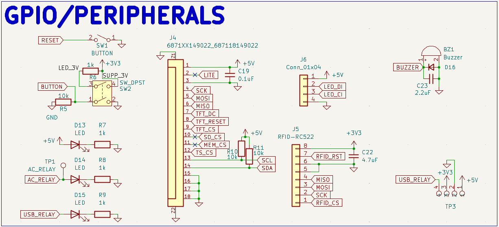

While the power and data interlocks are the meat and potatoes of the Portalbox, our peripherals and GPIO is the seasoning. These focus on all of our miscellaneous functions, both new and old. Historically the boxes have been as simple to use as possible, including simply a card slot, single pushbutton, and RGB LEDs for feedback. This functionality has been retained, but we hope to significantly improve it for future use.

### Casing
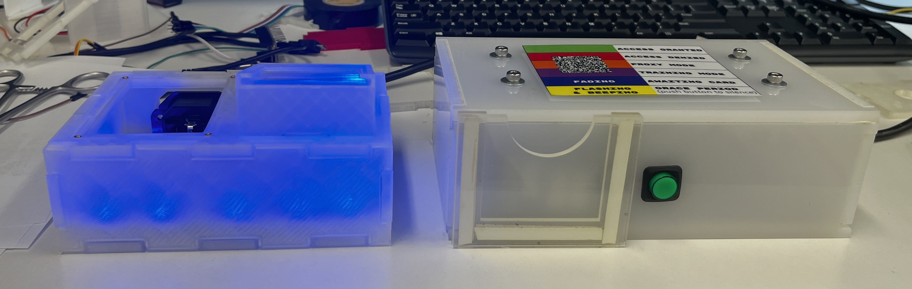
Size has been another important factor of consideration while moving through the current version of the Portalbox. Initial versions were vertically stacked components, so they were relatively compact and fit in the space well. The versions currently implemented moved away from the vertical architecture, so they expanded significantly in footprint next to machinery in the Maker-E. Beginning our project, we wanted to ensure that we could shrink this footprint at least a little bit so the Portalbox would be more usable and widely applicable for most makerspaces. Above is pictured a version 5.0.6 (left), which is the same size as a version 5.1, next to a currently implemented Portalbox (right). The difference is apparent.

#### Materials and Design

Previously Portalboxes were all made out of lasercut acrylic, which was intentionally a semi-transparent material designed to be opaque but let LED light through to color the box itself. This design has worked very well, but we had serveral quarrels with it when starting the project. First and foremost, it was very painful to construct. The pieces had to fit together very precisely and use Very Heavy Bond tape to stick together long-term. The acrylic material was also expensive to acquire. We found that the original reasoning to choose acrylic was that makerspaces would be able to manufacture their own cases if they had a laser cutter on hand, as we did. Considering this design decision, we chose to move the Portalbox to a 3D printed enclosure. Nowadays, especially in the ECE space, 3D printers are a staple of iterative design and most makerspaces have access to at least one. We tested multiple filament types and determined that Jessie Transparent PLA was strong yet still let through the appropriate amount of light from LEDs mounted on the board. Gyroid infill patterns also provide fun effects! While designing the case, we were focused on ensuring modularity and ease of use. The case is designed to snap together using dovetails and require no adhesive or tape to stay together long-term. Said dovetails also provide interesting opportunities for modularity.

#### Modularity

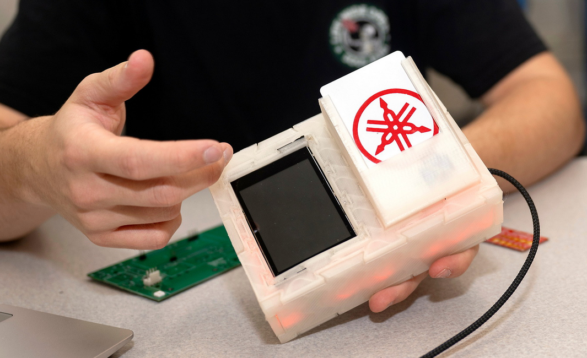
Utilizing the 3D printed nature of the case and the dovetail design, we determined a method to standardize our design and allow for some of the open-source mindset to enhance the Portalbox. First and foremost, the Portalbox case was designed with options in mind. There are multiple inputs and outputs that one can choose to use with the Portalbox and that will work natively and immediately with the firmware, all of which have case pieces designed to fit them. There are also options to fit the same inputs and outputs on different sides of the case for alternate mounting options. The peak of modularity can be seen on the top part of the case, where it simply features two large holes containing dovetails to slot other pieces into. With this design, we're able to manufacture modules which best fit our use-case: from touchscreens to buttons to card readers, it provides nearly unlimited opportunity to design what you want for your makerspace and customize your Portalbox appropriately. We hope that the nature of this design will encourage others to participate and begin designing alternate components that will work with all the previous ones we've provided as a starting point.

### User Feedback

Along with the above mention of modularity, we wanted to ensure that this version of the Portalbox would be able to continue in its current function as well as extend to new applications. Therefore, we kept all of the same standard inputs and outputs: a piezo buzzer to alert users, RGB addressable LEDs to provide status of the box, a simple button for a multifunctional input, and an RFID reader for the typical "slot" application. We also extended some of the more technical user feedback by including test points for important nets, as well as mono-color feedback LEDs for 5v power, AC relay activation, and USB relay activation. A reset button broken out to the user is also available in the case of a manual reset becoming necessary. However, with the aforementioned modular case, we also included some other options for administrators. The firmware provides for a "tap" mode, where users no longer have to leave their card inside a Portalbox to use equipment. They can simply tap it on the case, and a "proxy" mode will be handled all in software instead of requiring physical proxy cards. We also added a ribbon cable connector for Adafruit's Eye-SPI technology, making interfacing with one of their [ILI9341 capacitative touch displays](https://www.adafruit.com/product/2090 "Adafruit") simple to implement. We hope that this will spruce up our space and make the Portalboxes even easier to use, while not precluding previous use-cases.

Microcontroller

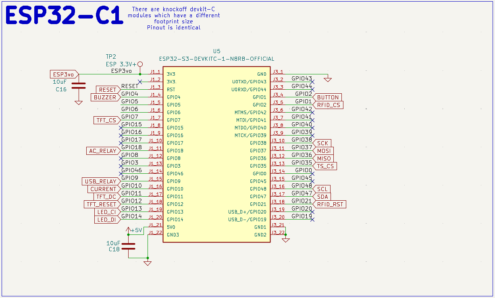
### History
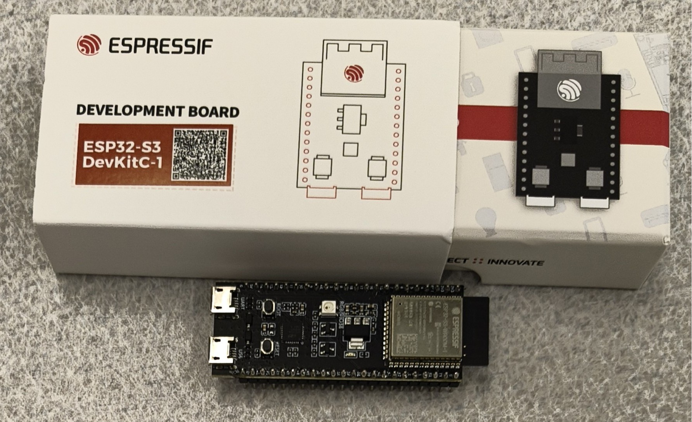 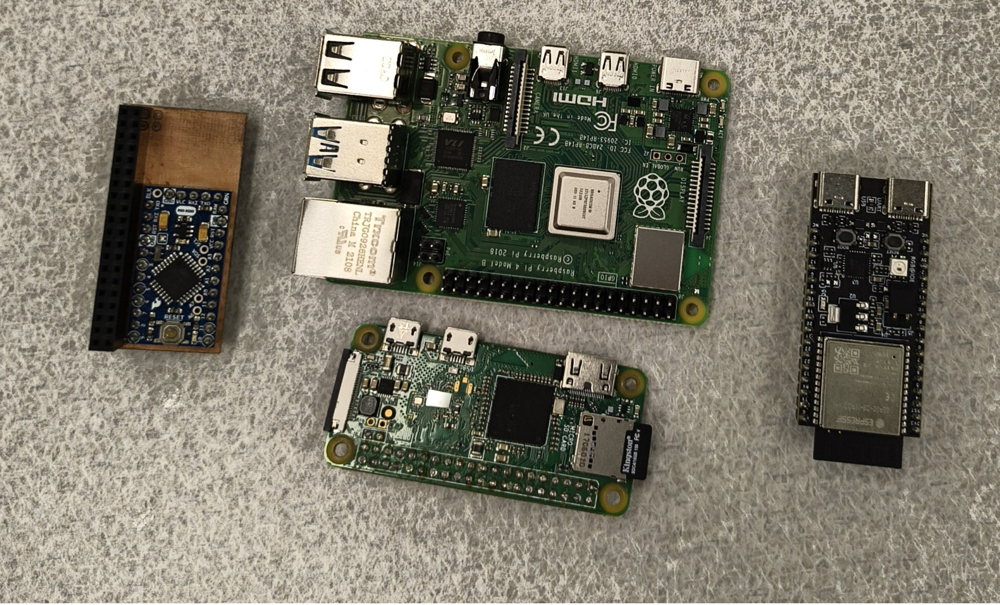

Historically, the Portalbox has been through every microcontroller you can think of. An original iteration used RP2040 breakout boards to do all processing on the platform, and connected a Pi Zero W to it for WiFi and API calling capabilities. Some time after that, a Raspberry Pi 4 was used to accomplish both tasks on one platform - at this point the Portalbox was running a full Linux OS with some firmware stored on it that would run upon boot.

During our time with the project, one of our main goals was to move platform to something that was smaller, less expensive, and more apt for the task. We chose to use the ESP32 platform, as it would still give us full internet capabilities while in a smaller form factor and with plenty of processing power to do the job. This turned our major limitation into GPIO.

We deliberately chose to utilize a [full devkit from Espressif](https://www.digikey.com/en/products/detail/espressif-systems/ESP32-S3-DEVKITC-1-N8R8/15295894 "Digikey") instead of simply placing the chip on our board. This decision was made for a multitude of reasons, but chief among them was that it made our lives easier and will continue to be effective far into the future. Long story short, all of the onboard electronics already included allowed us to focus on development of our other systems instead of worrying about setting up JTAG and the like. It also allows us to simply replace an entire module if something fails in the future, meaning these boards will be able to be used far into the future by simply replacing components and preventing the trashing of an entire board due to an oversight or failure.

Accordingly, we chose the Espressif devkit because they provide the most complete hardware output, as well as a fleshed out ESP-IDF toolchain for natively flashing boards if necessary. Specifically, the Espressif ESP32-S3-Devkit-C1 breaks out nearly all of the onboard GPIO so we can fit in all of our components that we need to and leave several pins for further expansion if we so desire. We originally began development with the ESP32-C6 devkit, but found it was too limited for our needs. The S3, specifically the C1-N8R8 revision, takes a larger footprint of the board but has proportionately more GPIO. Also beware of off-brand or alternate suppliers of devkits, as we found some with the same functionality but a very different physical footprint, being longer and skinnier. Be aware of the difference and make sure to purchase from Digikey or Adafruit. 

At different points we utilized ESP-IDF to flash our devkits with a custom build of Micropython. All firmware for the Portalbox is currently written in Micropython. There's a big focus on connectivity, and getting access to WPA3-Enterprise networks was a goal of ours. These networks are extremely common at universities and would make spreading the Portalbox much easier if they will natively hook up to existing WiFi networks. This is currently not implemented, as Micropython does not natively support Enterprise networks. There's a pending pull request that would implement it, so hopefully soon this capability will be added. In the meantime, our boxes are connected to the hidden Personal-class network on campus used in our engineering building.

Certification Compliance

