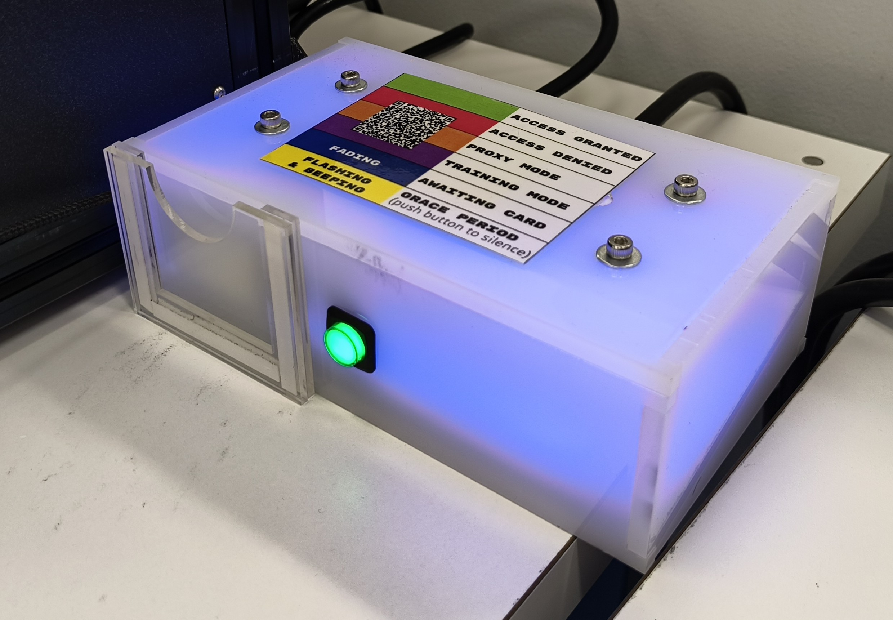
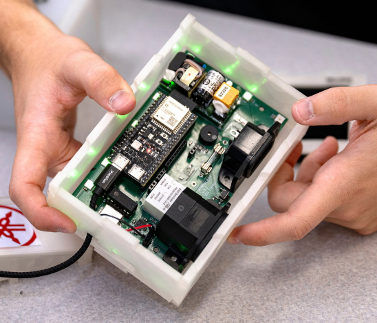
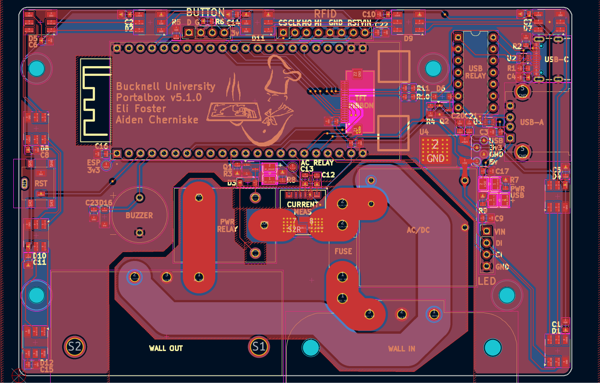
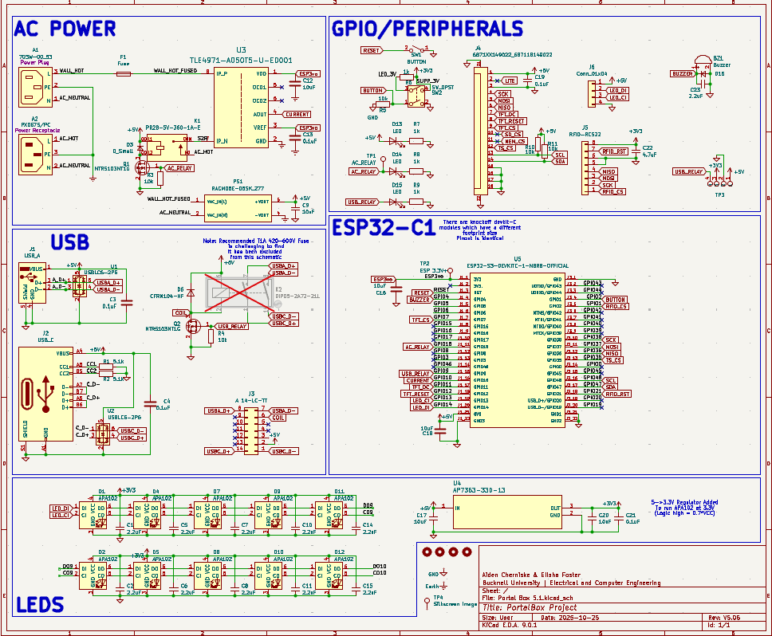
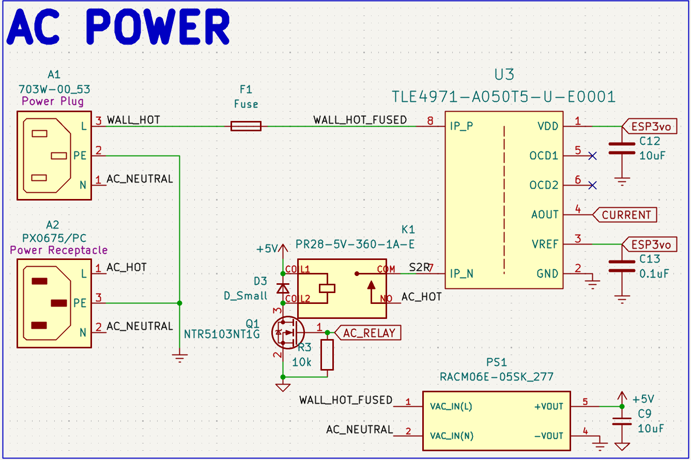
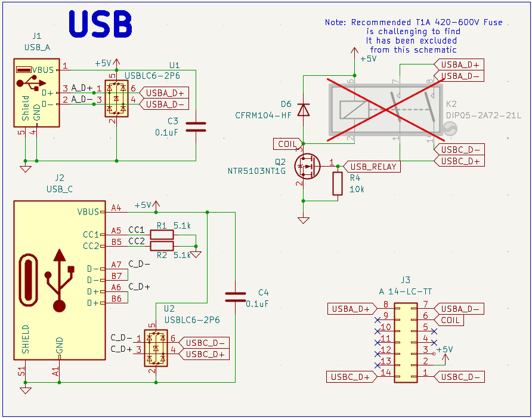
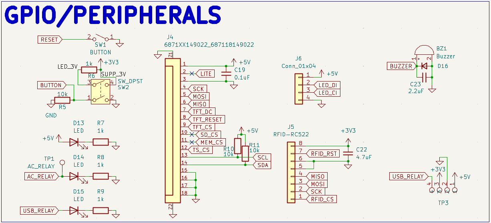
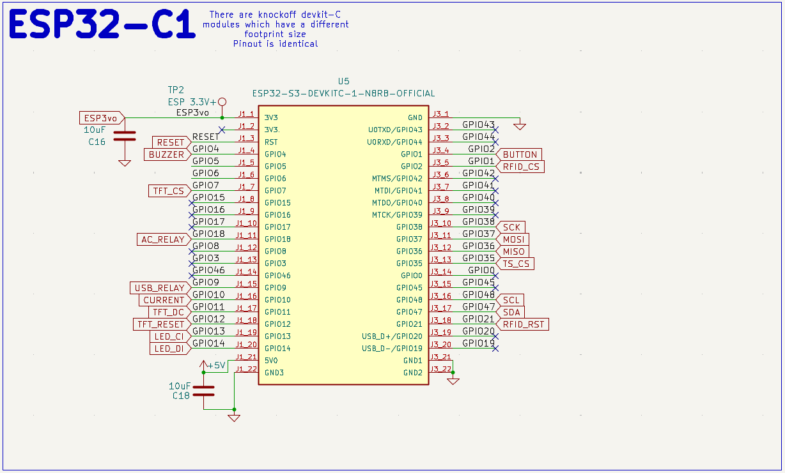

# Portal Box 5.1.0
## A project by Bucknellians for Bucknellians, since 2013

*The currently implemented Portalbox, v2, in the Maker-E connected to a Prusa XL (left) and a v5.0.6 prototype (right).*

## Background
The Portalbox is an open-source makerspace management project. It originated at Bucknell University and intends to spread worldwide, allowing makerspaces to control their equipment and their users as they see fit. The Portalbox focuses on using interlocks to control power to equipment, such as 3D printers or laser cutters, based on the RFID cards that each student possesses. I had the opportunity to work on v5 of the Portalbox over the summer of 2025, continuing into the academic year 25-26.

The Portalbox has been an ongoing project for roughly a decade, remaining open-source and created by students throughout its lifetime. Professor Joe Hass and software engineer TKEgan on GitHub have historically maintained the project for both firmware and backend development, including but not limited to the database and website access that's used by student techs to change permissions to each Portalbox.

Technical information

## Technical

*Portalbox v5.1.0 layout (left) and schematic (right)*

Power Interlock

### Overview
The Portalbox itself is powered off of 120Vrms from the wall, allowing for simpler placement and no worries or frustrations regarding battery power, lifetime, and so on. We use a hefty AC/DC converted to provide 5v power to the rest of the Portalbox, including the ESP32. We use relays to interlock wall power in between our two ports, one IEC C13 and one IEC C14. The female C13 is intended to be connected to wall power, while the male C14 is 15A fused output to makerspace equipment. We also include a current measurement IC to monitor power draw from a machine and monitor relay accuracy.
### Relay
We chose a [CUI Devices 20A relay](https://www.digikey.com/en/products/detail/same-sky-formerly-cui-devices/PR28-5V-360-1A-E/22522201?s=N4IgTCBcDa5mBmAtABwE5gBxIKwDckEA2ABiQEYBDJAUyQDsATEAXQF8g "Digikey") to ensure that our fuse would disconnect the circuit before any parts become damaged. The relay accepts the hot line from the wall and outputs it to the current measurement IC when the relay is activated. Activation is done using a simple [NMOS transistor](https://www.digikey.com/en/products/detail/diodes-incorporated/2N7002K-7/1934378?s=N4IgTCBcDa4HIHYAMSwGkC0CAiBJAwgCoZzYgC6AvkA "Digikey") circuit to allow for a 3v GPIO pin from the ESP32 to activate the relay using 5v (its required activation voltage). This specific transistor was chosen for availability, being pre-stocked in our space.

### Current Measurement
We're measuring current flowing from the wall out to the C14 port for a multitude of reasons. With proper implementation, this would allow for a measurement of "normal" current draw for any given machine, thus allowing continuous monitoring and flagging of any unusual or concerning behavior remotely. It would also allow us to retrieve records or throw a flag if our maximum of 15A is reached, thus requiring us to replace the onboard fuse. This would require some implementation with the existing MariaDB SQL database to store said current data and/or flags. Measurement is accomplished using an [Infineon IC](https://www.digikey.com/en/products/detail/infineon-technologies/TLE4971A050T5UE0001XUMA1/18700354?s=N4IgTCBcDaICoBkCiAWAnAdgIwFoCCADAKwFxE4CqOSBtWIAugL5A "Digikey") for this specific purpose. It's capable of +-120A, being much more than we need. It ouputs a variable voltage that depends on the current flowing through two major pads, allowing for later conversion into what specific current is being measured.

USB Interlock

### Overview
The Portalbox is equipped to provide data interlock through USB 2.0 between a USB-A port and a USB-C port. This is for specific applications such as the Maker-E's laser cutter, where proprietary power supply makes power interlock difficult. However, one is able to connect USB cables in between the cutter and a dedicated device to restrict data transfer of files required for laser cutting. It uses a similar relay structure to the power interlock to allow for robust switching.

### Relay
We use a [Standex-Meder](https://www.digikey.com/en/products/detail/standex-meder-electronics/DIP05-2A72-21L/2765346?s=N4IgTCBcDaICIEkAKAGArAWjAQQOxiwEYAZEAXQF8g "Digikey") DIP relay to allow for switching of data lines. It allows for simultaneous switching of two signals, which was necessary to interlock the D+/D- lines found in the USB 2.0 protocol. This particular relay may be out of stock and a Littelfuse equivealent is available. It's shown as excluded from the board in the schematic because we use a different [DIP header](https://www.digikey.com/en/products/detail/assmann-wsw-components/A-14-LC-TT/821743?s=N4IgTCBcDaIIIAICMAWAtAGQMJoCq5AF0BfIA "Digikey") J3 to allow for active switching of relays. Modularity is a big focus of the Portalbox, so switching of any components is ideal when possible.

### USB port design
We use typical four-pin USB-A 2.0 ports as well as USB-C ports capable of 3.0 on the board files seen above. They follow best practices found in the datasheet for design, including but not limited to ESD protection with diode system ICs U1 and U2. Both ports are always powered with 5v and have no data connection unless the above relays are active.

Peripherals and GPIO

Microcontroller

Certification Compliance

